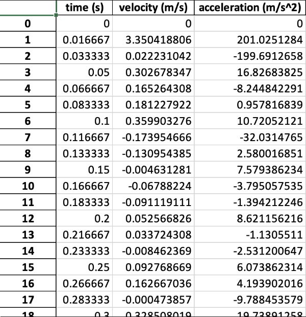

# Track Velocity from Video

The project uses machine learning to track an athlete's velocity and acceleration from a video of their sprint. The project uses [Mediapipe](https://github.com/google-ai-edge/mediapipe) to identify pose landmarks, whose incremental change in x-position is used to compute velocity and acceleration over time.

The project takes as input a single video, and generates four outputs:
- the athlete's velocity-time graph
- the athlete's acceleration-time graph
- an Excel file with the athlete's velocity and acceleration at consistent time increments
- a folder of video frames with the overlaid pose landmarks

To run the project, add the input video, titled `input.mp4`, in the same directory as the Jupyter notebook `TrackVelocity.ipynb`. Then simply run all the cells in the notebook. An `output` folder will be created containing the overlaid `frames`, `output_velocity_graph.png`, `output_acceleration_graph.png`, and `output_data.xlsx`.

Additionally, one may note that the notebook contains a parameter `frame_width_scale_meters`, which indicates the real-world length that corresponds to the width of one video frame, in meters. The value of this parameter may be changed to get results with accurate units.

## Sample Output Images

   
  

